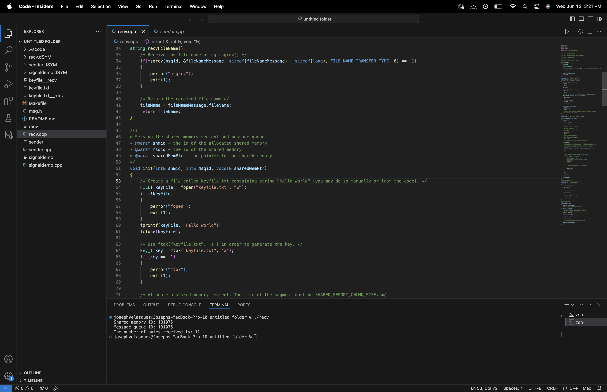

Collaboration: Communication was handled through a Discord group chat where designers selected their desired task and provided updates
 on how their work was going, to each other through out the week.
 
# Team
- Riya Jain [riyajain@csu.fullerton.edu] CPSC 351-01 Designed Sender.cpp file.
- Khushi Kaushik [kkaushik@csu.fullerton.edu] CPSC 351-01 Designed Resc.cpp file
- Edward Hernandez [pluvius@csu.fullerton.edu] CPSC 351-01 Bugfix/Documentation
- Joseph Velasquez [josephvelasquez@csu.fullerton.edu] CPSC 351-01 Bugfix/Testing

# shared-memory-messaging

An implementation of a file transfer mechanism using System V IPC mechanisms shared memory and message queues in C++. A "sender" reads a file and writes its contents to a shared memory. A "receiver" reads the data from the shared memory and processes it. In between, the sender-receiver communication is synchronized using message queues for data integrity and proper sequencing.

## Key Features
- Uses System V shared memory for fast data transfer between processes.
- Uses System V message queues for inter-process communication and synchronization.
- Breaks a large file into chunks to be sent across the platform to handle very large file sizes.
- Includes error handling for robust handling of edge cases.
- Shows setup, usage, and cleanup of IPC resources in a Linux environment.

## Usage Instructions
1. Compile the sender and receiver programs.
2. Run the receiver program to start listening in on incoming file data.
3. Run the sender program with the file you want to send as an argument.

## Files
- `sender.cpp`: The sender program reads a file and sends its data contents to the receiver.
- `recv.cpp`: The receiver program reads shared memory data and processes it.
- `msg.h`: Defines the structures used for messages.
- `Makefile`: Makefile for building the project.
- `signaldemo.cpp`: Simple Signal Handler.

## Example Commands
```sh
# Compile the programs
make recv.cpp
make sender.cpp

# Start the receiver
./recv

# Send a file
./sender <file_name>
```
# Testing Screenshot
[Showcase of Terminal Output after starting Receiver]

[Showcase of Terminal Output after starting Sender]
